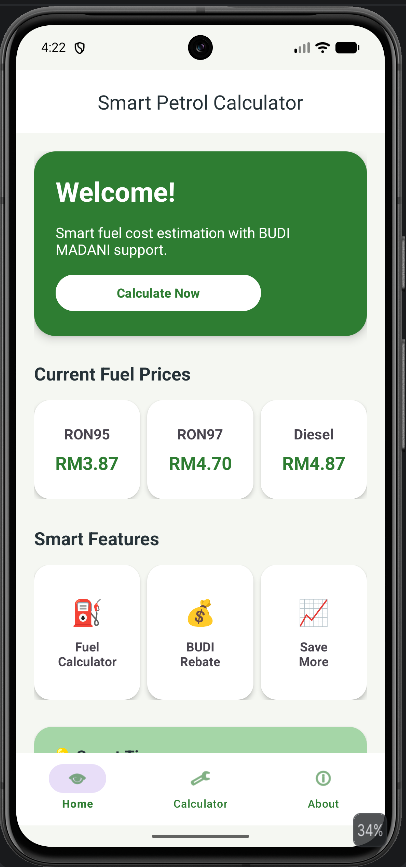
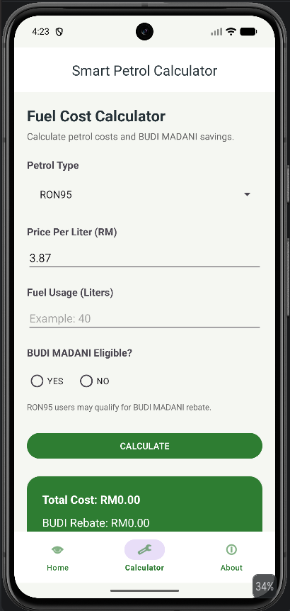
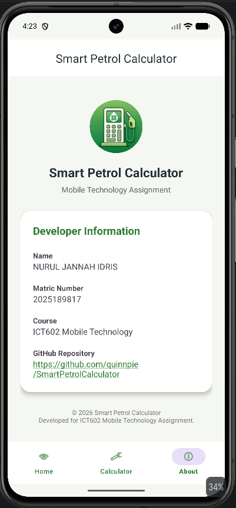

# Smart Petrol Calculator ⛽

Smart Petrol Calculator is an Android application developed using Java in Android Studio.  
The app helps users estimate fuel costs and check BUDI MADANI subsidy support based on selected petrol types.

---

## 📱 Features

- Modern dashboard-style Home page
- Fuel cost calculator
- Petrol type selection:
  - RON95
  - RON97
  - Diesel
- BUDI MADANI subsidy eligibility logic
- Estimated fuel cost calculation
- Total savings estimation
- Bottom navigation menu
- Custom application icon

---

## 🛠️ Technologies Used

- Java
- Android Studio
- XML Layout Design
- Material Design Components
- Fragment Navigation
- Git & GitHub

---

## 📷 Application Screenshots

### Home Page

### Calculator Page

### About Page

---

## 👨‍💻 Developer

Developed by: Nurul Jannah Binti Idris 
Course: ICT602 – Mobile Technology  
Semester: CS251 Part 5

---

## 📄 Copyright

© 2026 Smart Petrol Calculator  
Developed for academic purposes.
